# Task Master
Building an Android Task Master App. Which allows tracking tasks on a project.

## Feature Task

### Feature Tasks

#### Create Project

User should be able to create a Project

Home          |  Add Project |  Home After Add
:-------------------------:|:-------------------------: | :--------------------------------:
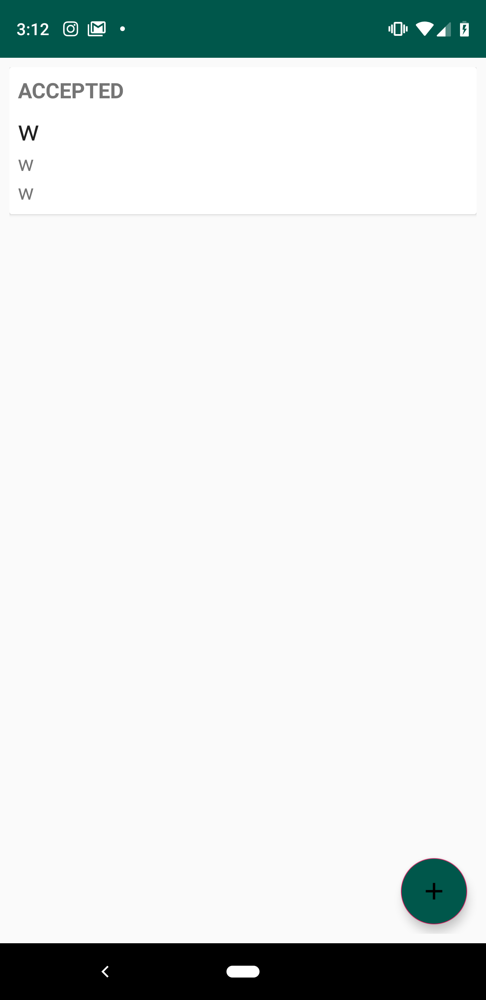  |   | 

#### Add Task

User should be able to add a task to a Project

User should be able to assign themselves a task, accept that task, and later finish that task

Update Task          |  Home After Update
:-------------------------:|:-------------------------:
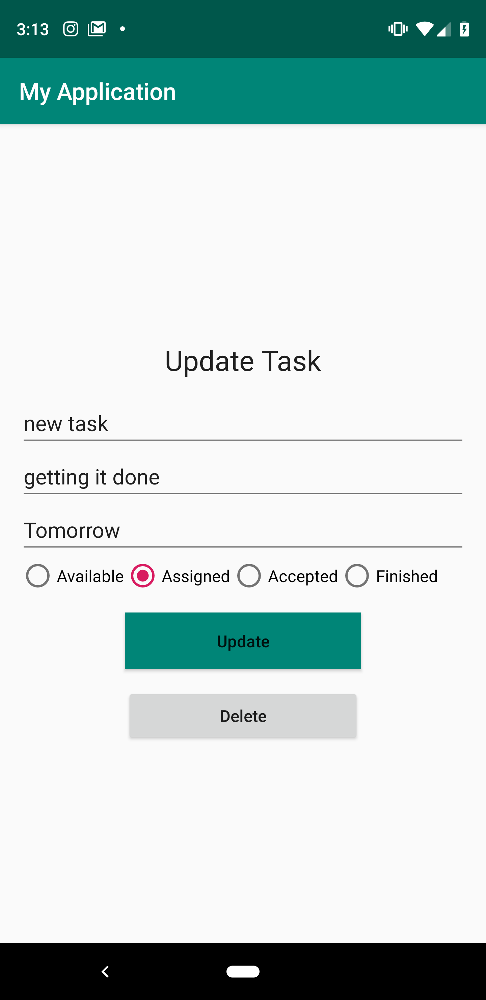  |  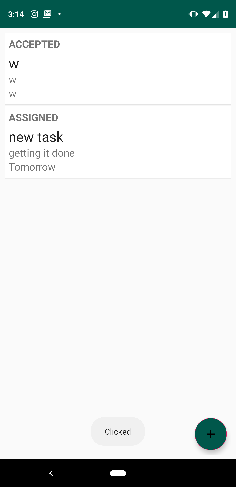

## Fire Base Functionality

Firebase as a backend for our TaskMaster App

Home          |  User Welcome Screen |  Home After Add
:-------------------------:|:-------------------------: | :--------------------------------:
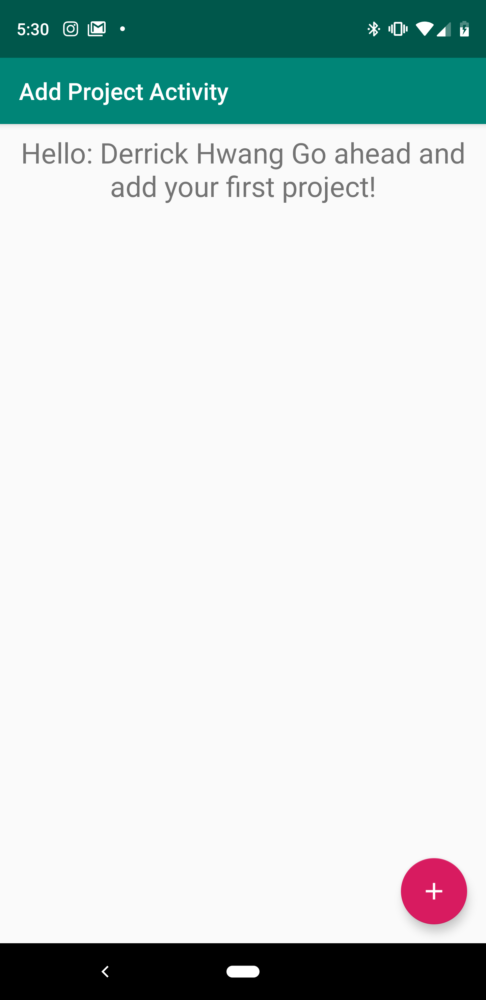  |  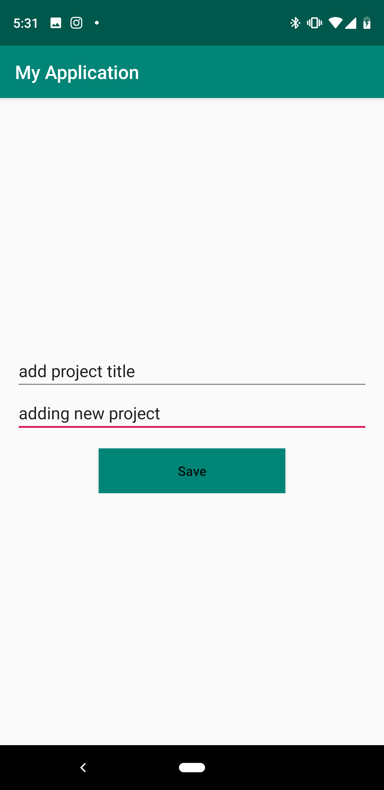 | 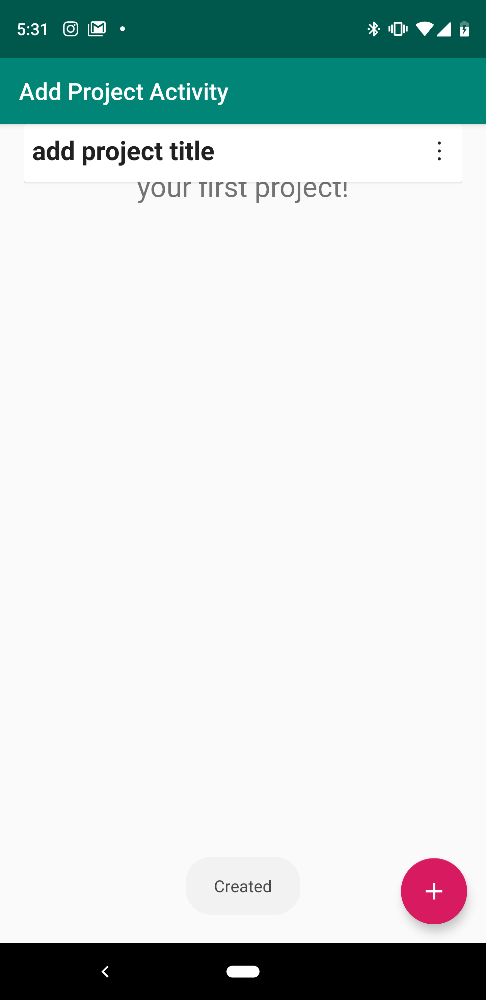

#### User Login 

User login with email and password

Home          |  User Welcome Screen |  Home After Add
:-------------------------:|:-------------------------: | :--------------------------------:
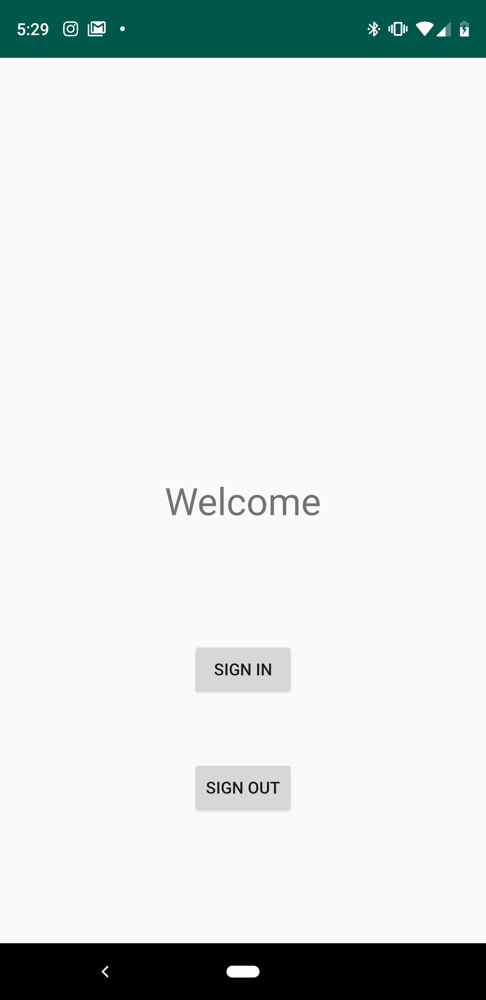  |  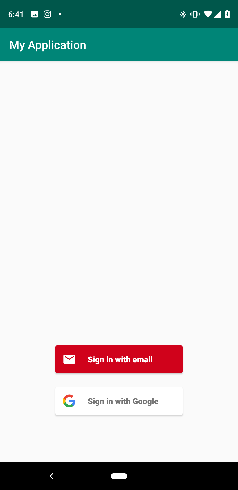 | 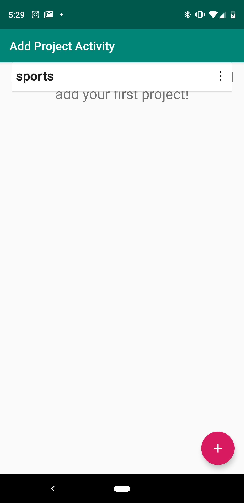

#### User Projects in Firebase Database

User created projects in Firestore cloud database

Add Project          |  Firebase Project
:-------------------------:|:-------------------------:
  |  

Edit Project          |  Edit Option
:-------------------------:|:-------------------------:
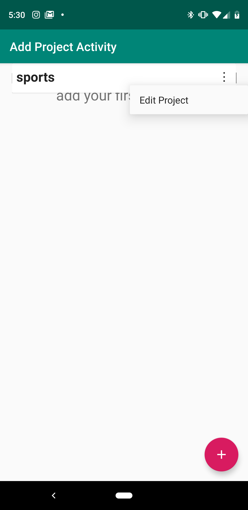  |  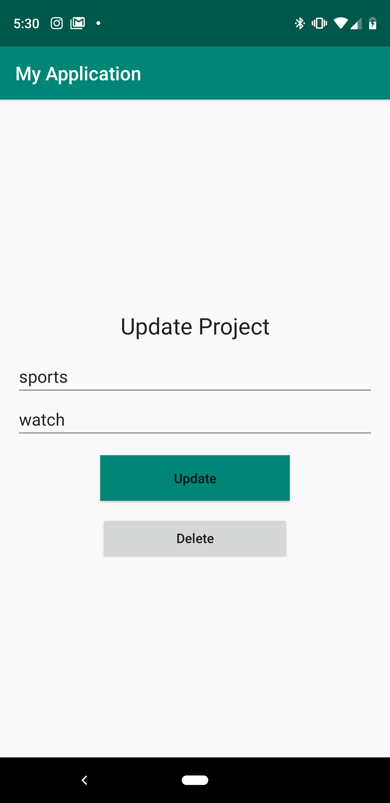

#### User Tasks in Firebase Database

User created tasks to those projects

Home          |  User Welcome Screen |  Home After Add
:-------------------------:|:-------------------------: | :--------------------------------:
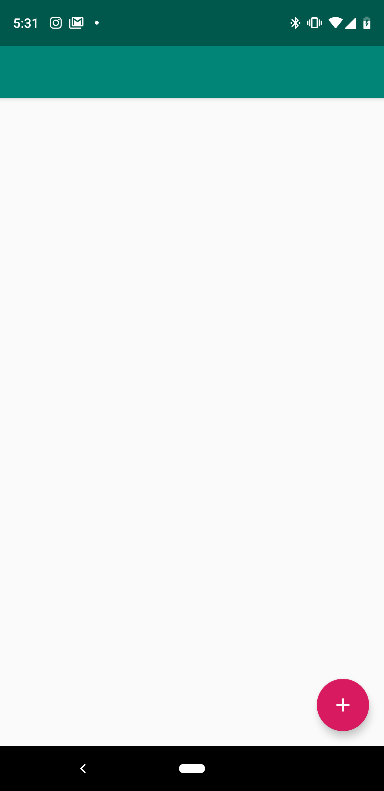  |  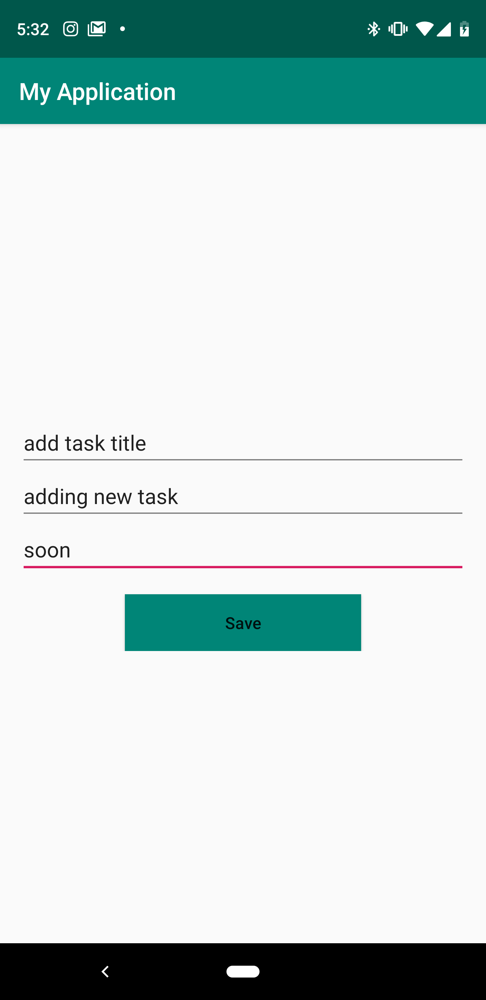 | 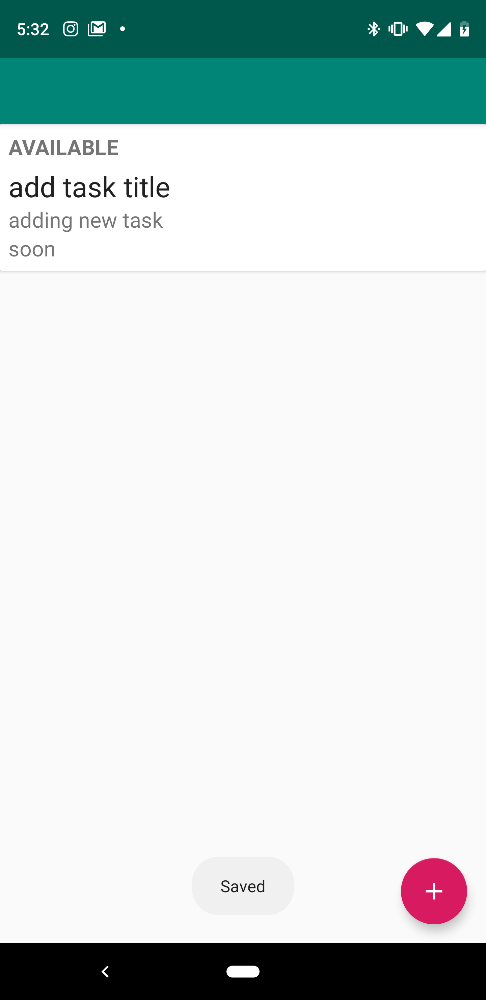

#### User ability to assign task

Ability to allow users to "Assign" a task to themself

The user assgined to a task should be able to "Accept" that task, and later "Finish" that task. 

Home          |  User Welcome Screen |  Home After Add
:-------------------------:|:-------------------------: | :--------------------------------:
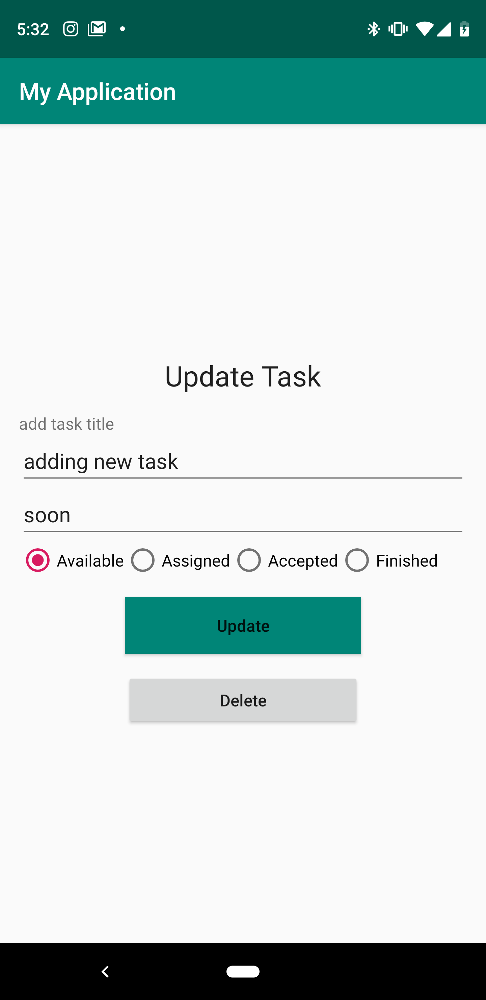  |  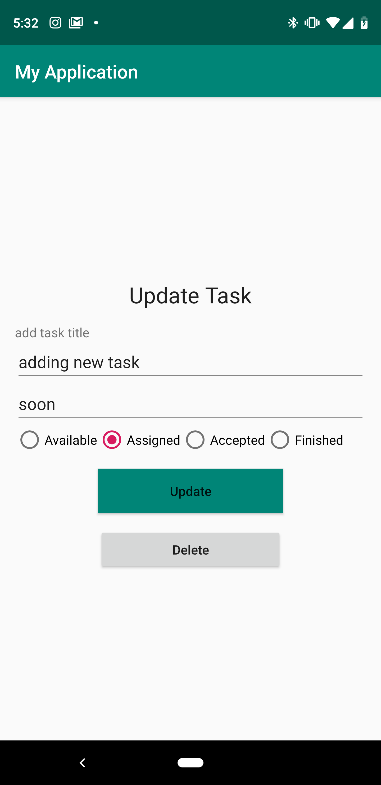 | 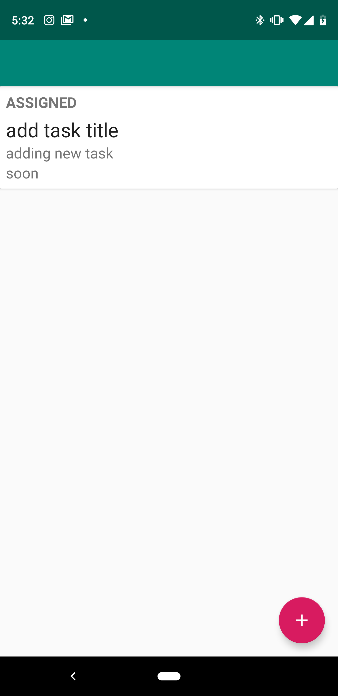

Add Project          |  Firebase Project
:-------------------------:|:-------------------------:
  |  

## Credit/Sources 
[RecyclerView](https://code.tutsplus.com/tutorials/getting-started-with-recyclerview-and-cardview-on-android--cms-23465)

[Material Icons](http://google.github.io/material-design-icons/)

[Floating Action Bar](https://guides.codepath.com/android/floating-action-buttons)

[Enums](https://javarevisited.blogspot.com/2011/08/enum-in-java-example-tutorial.html) 
 * special shout out to Tara Johnson, Suzanne Richman, and Michelle Ferreirae for their conceptual teaching
 
 [Radio Group - Check Listener](https://stackoverflow.com/questions/18536195/android-oncheckedchanged-for-radiogroup)
 
 [Type Converter](https://stackoverflow.com/questions/47435686/room-orm-enum-type-converter-error)
 
 [Type Converter - 2](https://stackoverflow.com/questions/44498616/android-architecture-components-using-enums)
 
 [Document Reference - Sub Collection](https://stackoverflow.com/questions/47514419/how-to-add-subcollection-to-a-document-in-firebase-cloud-firestore)
 
 [Document Reference](https://codelabs.developers.google.com/codelabs/firestore-android/#6)
 
 ## ChangeLog
 
 1/28/2019: Initial project setup(layout, room, migrate to androidX, activity adding and deleting tasks)
 
 1/29/2019: Added in button group and enum type properties to entity model. 
 
 1/30/2019: Finished enum properties, added in state converter class, refactored adapter and activity, updated readme.
 
 1/31/2019: Added in Sign in for Firebase
 
 2/01/2019: Added in Signout for Firebase and finished auth
 
 2/02/2019: Added in Firestore and completed add, delete functionality to Firestore database. 
 
 2/03/2019: Updated readme and added in Firebase update functionality 

