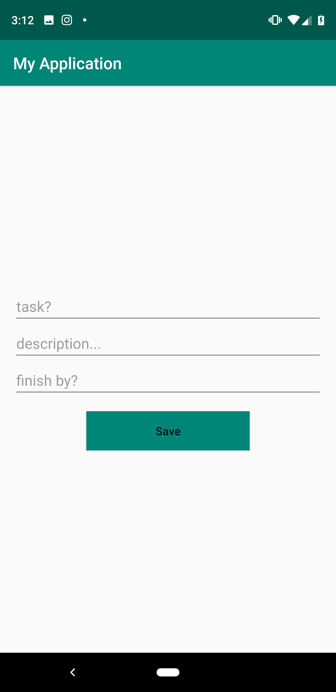
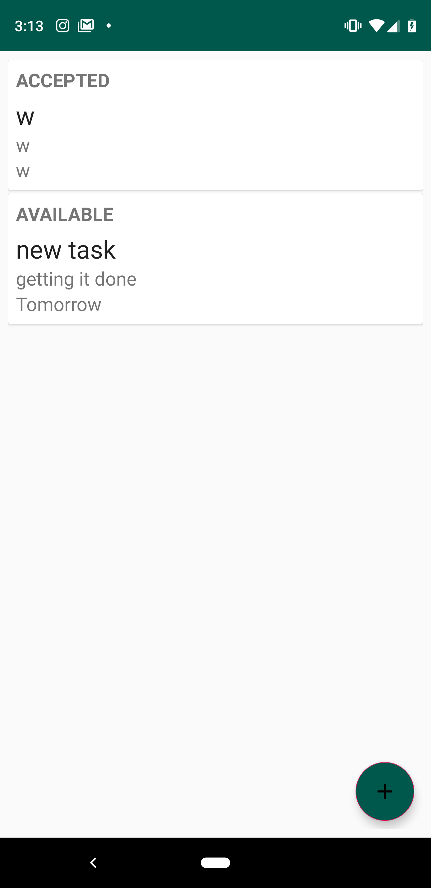

# Task Master
Building an Android Task Master App. Which allows tracking tasks on a project.

## Feature Task

### Feature Tasks

#### Create Project

User should be able to create a Project

Home          |  Add Project |  Home After Add
:-------------------------:|:-------------------------: | :--------------------------------:
  |   | 

#### Add Task

User should be able to add a task to a Project

User should be able to assign themselves a task, accept that task, and later finish that task

Update Task          |  Home After Update
:-------------------------:|:-------------------------:
  |  

## Credit/Sources 
[RecyclerView](https://code.tutsplus.com/tutorials/getting-started-with-recyclerview-and-cardview-on-android--cms-23465)

[Material Icons](http://google.github.io/material-design-icons/)

[Floating Action Bar](https://guides.codepath.com/android/floating-action-buttons)

[Enums](https://javarevisited.blogspot.com/2011/08/enum-in-java-example-tutorial.html) 
 * special shout out to Tara Johnson, Suzanne Richman, and Michelle Ferreirae for their conceptual teaching
 
 [Radio Group - Check Listener](https://stackoverflow.com/questions/18536195/android-oncheckedchanged-for-radiogroup)
 
 [Type Converter](https://stackoverflow.com/questions/47435686/room-orm-enum-type-converter-error)
 
 [Type Converter - 2](https://stackoverflow.com/questions/44498616/android-architecture-components-using-enums)
 
 ## ChangeLog
 
 1/28/2019: Initial project setup(layout, room, migrate to androidX, activity adding and deleting tasks)
 
 1/29/2019: Added in button group and enum type properties to entity model. 
 
 1/30/2019: Finished enum properties, added in state converter class, refactored adapter and activity, updated readme. 
